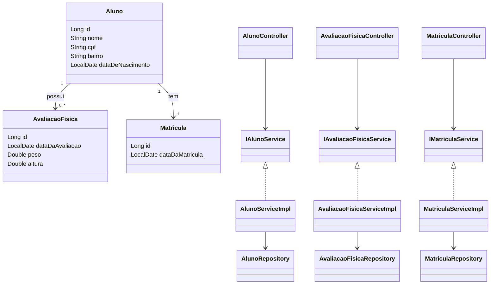

# 🏋️ Academia Digital API

API RESTful para gerenciamento de uma academia digital, desenvolvida com **Spring Boot** e **Spring Data JPA**, seguindo boas práticas de arquitetura em camadas.

---

## 📌 Objetivo

Este projeto tem como objetivo implementar um sistema CRUD completo para:

- 👤 Alunos
- 📊 Avaliações Físicas
- 📝 Matrículas

---

## 🚀 Tecnologias Utilizadas

- Java 17+
- Spring Boot
- Spring Data JPA
- Hibernate
- PostgreSQL (ou outro banco relacional)
- Jackson (Serialização JSON)
- Maven

---

## 📂 Estrutura do Projeto

```bash
src/main/java/desafio/jpa/academia/academia_digital
│
├── controller         # Camada de entrada (REST API)
│
├── entity             # Entidades JPA (modelo de domínio)
│   └── form           # DTOs de entrada (Form)
│
├── infra.ser          # Configurações e serialização customizada
│
├── repository         # Interfaces JPA Repository
│
├── service            # Interfaces de regras de negócio
│   └── impl           # Implementações dos serviços
│
└── AcademiaDigitalApplication
```

---

## 🧠 Arquitetura

O projeto segue o padrão **Layered Architecture (Arquitetura em Camadas)**:

- **Controller** → Recebe requisições HTTP
- **Service** → Contém regras de negócio
- **Repository** → Acesso ao banco de dados
- **Entity** → Representação das tabelas
- **Form/DTO** → Entrada e saída de dados

---

## 🔄 Fluxo da Aplicação

Cliente → Controller → Service → Repository → Banco de Dados

---

## 📊 Diagrama de Classes (Mermaid)



---

## 🧾 Padrões Utilizados

- DTO (Data Transfer Object)
- Form Objects (entrada de dados)
- Repository Pattern
- Service Layer Pattern
- Separation of Concerns

---

## ⚙️ Configuração e Execução

### 🔧 Pré-requisitos

- Java 17+
- Maven
- Banco de dados configurado (PostgreSQL recomendado)

---

### ▶️ Executando o projeto

```bash
git clone <URL_DO_REPOSITORIO>
cd academia-digital
mvn spring-boot:run
```

---

## 🔌 Endpoints (Exemplo)

### 👤 Aluno

- POST /alunos
- GET /alunos
- GET /alunos/{id}
- PUT /alunos/{id}
- DELETE /alunos/{id}

---

## 🧩 Serialização de Datas

O projeto utiliza:

- @JsonFormat(pattern = "dd/MM/yyyy")
- CustomLocalDateDeserializer

---

## 📈 Melhorias Futuras

- Autenticação com Spring Security
- Documentação com Swagger/OpenAPI
- Testes automatizados
- Relatórios

---

## 👨‍💻 Autor

Desenvolvido por Artur

---

## 📜 Licença

MIT
